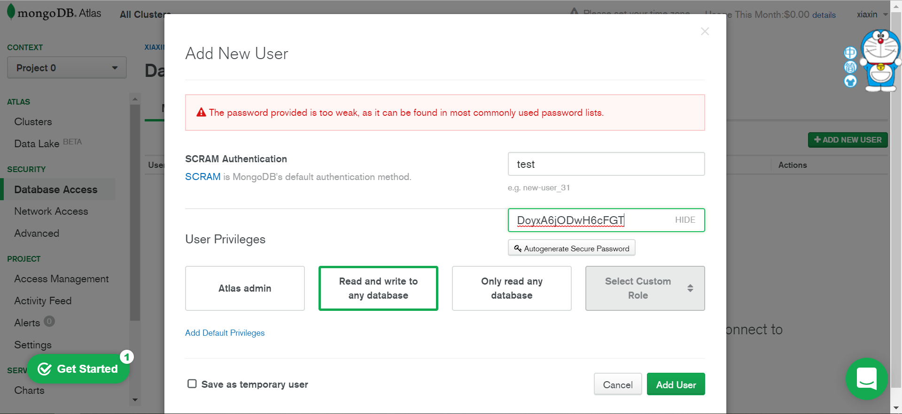
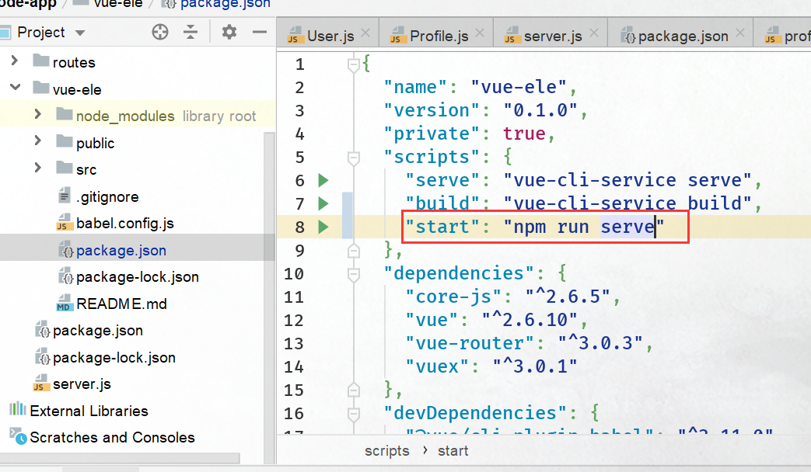
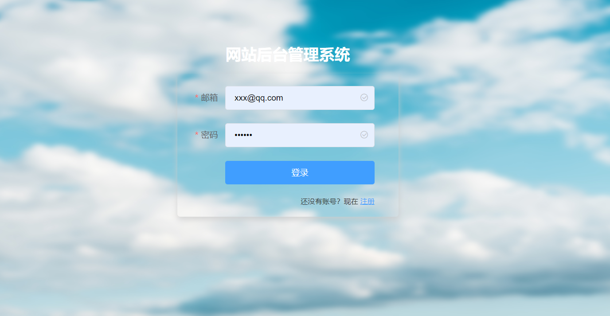
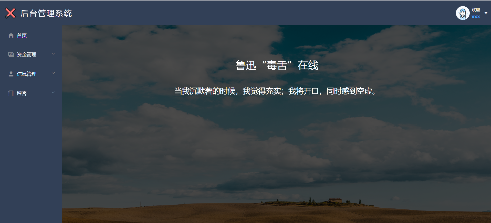
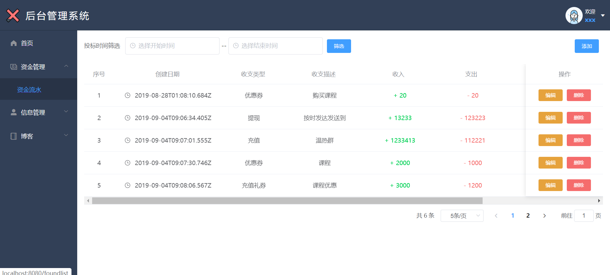
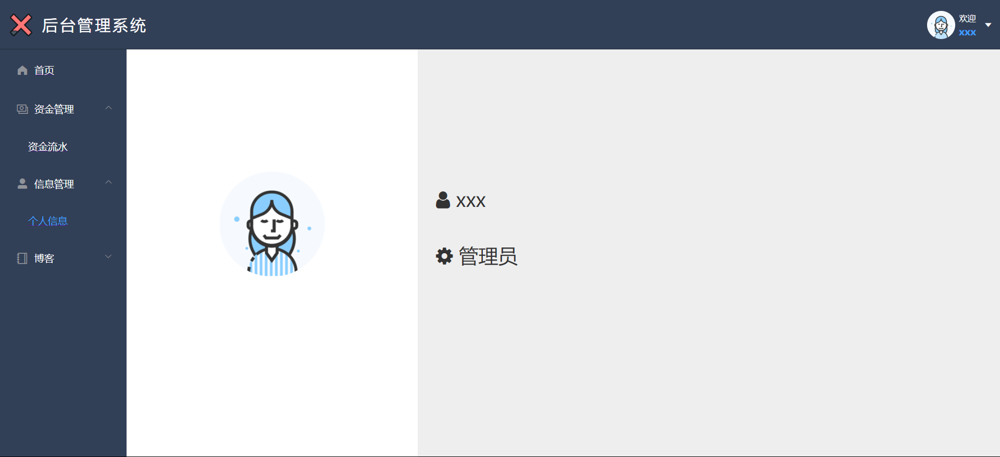
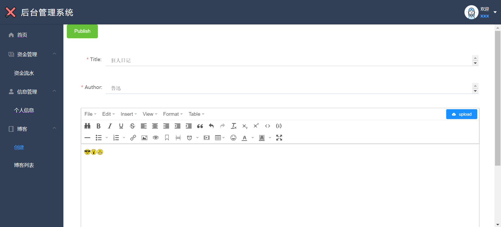
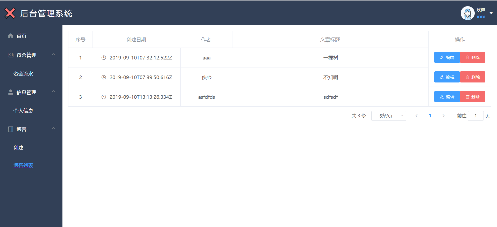

```
# npm install nodemon -g   //全局安装
# node server.js //运行
```

### 1）使用MongoDB云数据库

[免费试用MongoDB云数据库 （MongoDB Atlas）教程](https://www.cnblogs.com/xybaby/p/9460634.html)

### 2）使用mongoose

```
# npm install mongoose
```



DoyxA6jODwH6cFGT

### 3）Express的中间件 BodyParser， 加密

**body-parser**

在http请求种，POST、PUT、PATCH三种请求方法中包含着请求体，也就是所谓的request，在Nodejs原生的http模块中，请求体是要基于流的方式来接受和解析。
body-parser是一个HTTP请求体解析的中间件，使用这个模块可以解析JSON、Raw、文本、URL-encoded格式的请求体，
作者：losspm链接：https://www.jianshu.com/p/cd3de110b4b6来源：简书简书著作权归作者所有，任何形式的转载都请联系作者获得授权并注明出处。

**加密**

```
# npm install bcrypt
```


# 前后端连载

1 在vue项目中的json文件加入



2 在node项目package.json中添加


以在运行时添加前端项目的依赖模块

```
"client": "npm start -prefix client",   //启动前端项目
```


#  运行界面

 登录页



主页面



表格



个人信息



博客




